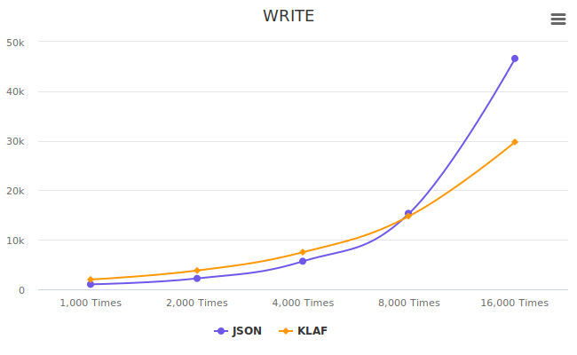
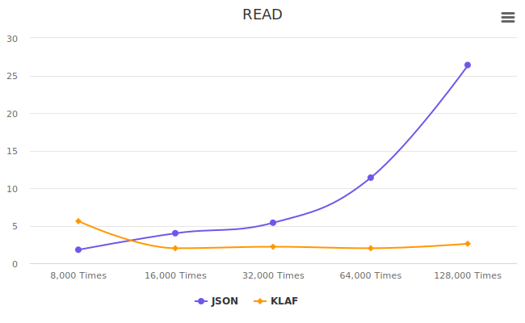

# Tissue Roll

  

Very simple read/write database with a **NoSQL**.  
It's written in JavaScript using pure Node.js API and pretty easy and small.

**tissue-roll** comes in two flavors: **key-value** database and **document-oriented** database.  
You have the freedom to choose based on your needs, **but most users will likely prefer the *document-oriented* database.**

For details on how to use each database, please refer to the links below.

* [**Document-oriented Database**](./docs/document/README.md)
* [**Key-value Database**](./docs/core/README.md)

## Why

### Why use **tissue-roll**?

JavaScript has numerous fantastic database libraries available, but at times, they can seem overly complex.  
This particular solution is ideal for situations where you need to store data for an extended period, making it well-suited for less critical data that doesn't require a rigid structure. Or when it's annoying.

### Why should I use this instead of **JSON**?

When the **JSON** files get large, quick data read and write operations can become challenging.  
**tissue-roll** handles data input and output in real-time, ensuring fast and lightweight performance. Check the performance tests below.

## How

### How does it differ from a **Map** object?

The **Map** object is memory-based, while **tissue-roll** is file system-based.

### How does **tissue-roll** work?

**tissue-roll** manages files by breaking them into blocks called pages. You can set the page size when creating the database.

When you insert data, the ID you get back includes information about where the data is stored on the page. This makes it possible to work with large files quickly. This value could be seen by users, but it's encrypted to make it hard to predict. This way, it stops users from trying to steal data by requesting fake record IDs.

### How many can I own data?

**tissue-roll** can make a unsigned 32bit range of page block. This is a **4,294,967,296**. And each page can own unsigned 32bit range of records also. So you can theoretically insert **4,294,967,295** * **4,294,967,295** records.

## Performance Test

The test result is the average value from 10 attempts.

**tissue-roll** supports two databases, and this test tested the core functions of data reading/writing of the two databases. Therefore, it's not a perfect test result, but it's enough to show the time complexity.

If you're adding data to the database in real-time, the results would be as follows:

### WRITE

For a little data, JSON is faster, but when you've got a big file, it's the other way around, and the gap gets bigger.

|`WRITE`|JSON|TISSUE-ROLL|`RESULT`|
|---|---|---|---|
|1,000 times|1014ms|1990ms|*-49% Slower*|
|2,000 times|2200ms|3800ms|*-42% Slower*|
|4,000 times|5674ms|7509ms|*-24% Slower*|
|8,000 times|15332ms|14788ms|***+4% Faster***|
|16,000 times|46617ms|29755ms|***+57% Faster***|

### READ

**tissue-roll** maintains a steady reading speed no matter the database size. In contrast, JSON files slow down as they get bigger.

|`READ`|JSON|TISSUE-ROLL|`RESULT`|
|---|---|---|---|
|from 8,000 records|1.8ms|5.6ms|*-68% Slower*|
|from 16,000 records|4ms|2ms|***+100% Faster***|
|from 32,000 records|5.4ms|2.2ms|***+145% Faster***|
|from 64,000 records|11.4ms|2ms|***+470% Faster***|
|from 128,000 records|26.4ms|2.6ms|***+915% Faster***|

### RESULT

**NOTICE!**

*This is the usual case, but the results can be different depending on programming optimizations. Please note that this test takes a square of the sample size to easily show the error with a small number of tests. Therefore, the graph appears to increase exponentially, but in terms of time complexity, JSON has **O(n)**, and tissue-roll has a speed of **O(1)**.*

## Install

|Site|Link|
|---|---|
|**NPM**|[View](https://www.npmjs.com/package/tissue-roll)|
|**Github**|[View](https://github.com/izure1/tissue-roll)|

## License

MIT LICENSE
