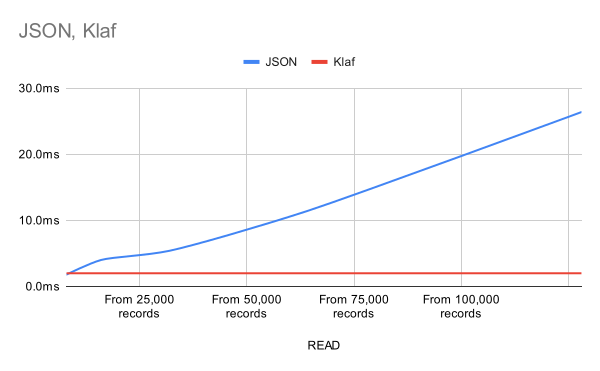

# Tissue Roll

Very simple read/write database with a `key-value`.  
It's written in JavaScript using pure Node.js API and pretty easy and small.

## Usage

```typescript
import { TissueRoll } from 'tissue-roll'

// OPEN DB
const payloadSize = 8192
const db = TissueRoll.Open('my_file_path.db', payloadSize)

// INPUT
const data = 'Data string you want to store'
const id = db.put(data)

db.pick(id).record.payload // 'Data string you want to store'


// UPDATE
const modifiedData = 'Modified data string you want to store'
db.update(id, modifiedData)
db.pick(id).record.payload // 'Modified data string you want to store'

// HOOK - When updating, add '!!!' after the data.
db.onBefore('update', (record) => {
  record.data += '!!!'
  return record
})

db.update(id, 'POWER')
db.pick(id).record.payload // 'POWER!!!'

// DELETE
db.delete(id)
db.pick(id) // Error! The record was destroyed.

// CLOSE DB
db.close()
```

## Why

### Why use `tissue-roll`?

JavaScript has numerous fantastic database libraries available, but at times, they can seem overly complex.  
This particular solution is ideal for situations where you need to store data for an extended period, making it well-suited for less critical data that doesn't require a rigid structure. Or when it's annoying.

### Why should I use this instead of `JSON`?

When the `JSON` files get large, quick data read and write operations can become challenging.  
`tissue-roll` handles data input and output in real-time, ensuring fast and lightweight performance. Check the performance tests below.

### Where can this be used?

It can be used, for example, to create website URLs. You save a post and insert the obtained record ID into the URL address.

## How

### How does it differ from a `Map` object?

The `Map` object is memory-based, while `tissue-roll` is file system-based.

### How does `tissue-roll` work?

`tissue-roll` manages files by breaking them into blocks called pages. You can set the page size when creating the database.

When you insert data, the ID you get back includes information about where the data is stored on the page. This makes it possible to work with large files quickly. This value could be seen by users, but it's encrypted to make it hard to predict. This way, it stops users from trying to steal data by requesting fake record IDs.

### How many can I own data?

`tissue-roll` can make a unsigned 32bit range of page block. This is a `4,294,967,296`. And each page can own unsigned 32bit range of records also. So you can theoretically insert `4,294,967,295`*`4,294,967,295` records.

## Performance Test

The test result is the average value from 10 attempts.  
If you're adding data to the database in real-time, the results would be as follows:

### WRITE

For a little data, JSON is faster, but when you've got a big file, it's the other way around, and the gap gets bigger.

|`WRITE`|JSON|TISSUE-ROLL|`RESULT`|
|---|---|---|---|
|1,000 times|1014ms|1990ms|*-49% Slower*|
|2,000 times|2200ms|3800ms|*-42% Slower*|
|4,000 times|5674ms|7509ms|*-24% Slower*|
|8,000 times|15332ms|14788ms|***+4% Faster***|
|16,000 times|46617ms|29755ms|***+57% Faster***|

### READ

`tissue-roll` maintains a steady reading speed no matter the database size. In contrast, JSON files slow down as they get bigger.

|`READ`|JSON|TISSUE-ROLL|`RESULT`|
|---|---|---|---|
|from 8,000 records|1.8ms|5.6ms|*-68% Slower*|
|from 16,000 records|4ms|2ms|***+100% Faster***|
|from 32,000 records|5.4ms|2.2ms|***+145% Faster***|
|from 64,000 records|11.4ms|2ms|***+470% Faster***|
|from 128,000 records|26.4ms|2.6ms|***+915% Faster***|

### RESULT




**NOTICE!** *This is the usual case, but the results can be different depending on programming optimizations.*

## Install

|Site|Link|
|---|---|
|**NPM**|[View](https://www.npmjs.com/package/tissue-roll)|
|**Github**|[View](https://github.com/izure1/tissue-roll)|

## API

### Static Functions

#### TissueRoll.Create(file: `string`, payloadSize = `8192`, overwrite = `false`): `TissueRoll`

It creates a new database file.

#### TissueRoll.Open(file: `string`, payloadSize = `0`): `TissueRoll`

It opens or creates a database file at the specified path. If `payloadSize` parameter value is specified as a positive number and there's no database file at the path, it will create a new one.

### Methods

#### put(data: `string`): `string`

You store data in the database and receive a record ID for the saved data. This ID should be stored separately because it will be used in subsequent update, delete, and pick methods.

#### update(recordId: `string`, data: `string`): `string`

You update an existing record.

If the inserted data is shorter than the previous data, the existing record is updated.
Conversely, if the new data is longer, a new record is created.

These newly created records are called `alias record`, and when you call the `pick` method using the current record ID, the alias record is retrieved.
If an alias record existed previously, the existing alias record is deleted and can no longer be used.

#### delete(recordId: `string`): `void`

You delete a record from the database, but it's not completely erased from the file. The record becomes unusable.

#### pick(recordId: `string`): `RecordInformation`

Get record from database with a id.  
Don't pass an incorrect record ID. This does not ensure the validity of the record.
If you pass an incorrect record ID, it may result in returning non-existent or corrupted records.

#### exists(recordId: `string`): `boolean`

It returns whether the record exists in the database. If it has been deleted or has an invalid record ID, it returns `false`.

#### onBefore(command: `'put'`|`'update'`|`'delete'`, callback: (arg: `any`) => `any`): `this`

Register preprocessing functions for hooking before executing database operations such as `put`, `update`, and `delete` commands.  
The value returned by this callback function is what is actually applied to the database.

If multiple pre-processing functions are registered, they run sequentially, with each subsequent pre-processing function receiving the value returned by the previous one as a parameter.

#### onceBefore(command: `'put'`|`'update'`|`'delete'`, callback: (arg: `any`) => `any`): `this`

Same as the `onBefore` method, but only works once. For more information, see the `onBefore` method.

#### onAfter(command: `'put'`|`'update'`|`'delete'`, callback: (arg: `any`) => `any`): `this`

Register post-processing functions for hooking after performing database operations such as `put`, `update`, and `delete` commands.  
You can use the value returned by this callback function for additional operations.

If multiple post-processing functions are registered, they run sequentially, with each subsequent post-processing function receiving the values returned by the previous one as parameters.

#### onceAfter(command: `'put'`|`'update'`|`'delete'`, callback: (arg: `any`) => `any`): `this`

Same as the `onAfter` method, but only works once. For more information, see the `onAfter` method.

#### offBefore(command: `'put'`|`'update'`|`'delete'`, callback: (arg: `any`) => `any`): `this`

You remove the pre-processing functions added with `onBefore` or `onceBefore` methods.  

If there is no callback parameter, it removes all pre-processing functions registered for that command.

#### offAfter(command: `'put'`|`'update'`|`'delete'`, callback: (arg: `any`) => `any`): `this`

You remove the post-processing functions added with `onAfter` or `onceAfter` methods.  

If there is no callback parameter, it removes all post-processing functions registered for that command.

## License

MIT LICENSE
