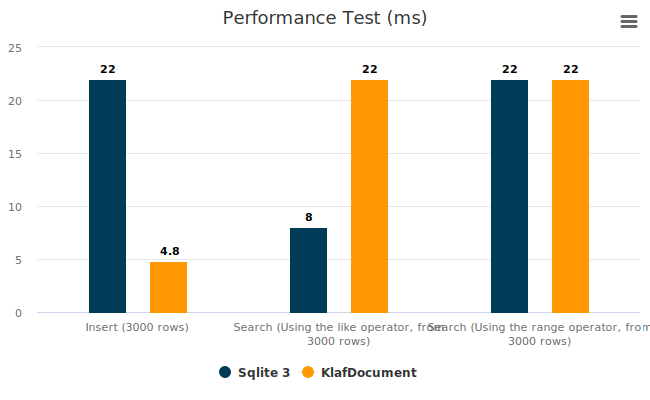

# Klaf with Document

This document covers the usage of the **document-oriented** database in **klaf**.

The document database in **klaf** allows you to insert data in **JSON** format. Specify each property in TypeScript.

If this is not the database you were looking for, please check the [key-value](../core/README.md) database.

## Usage

```typescript
import { KlafDocument, DataJournal } from 'klaf.js'
import { FileSystemEngine } from 'klaf.js/engine/FileSystem'

// OPEN DB
const db = await KlafDocument.Open({
  path: 'my_file_path.db',
  engine: new FileSystemEngine(),
  journal: new DataJournal(new FileSystemEngine()),
  version: 0,
  scheme: {
    name: {
      default: () => 'Anonymous',
      validate: (v) => typeof v === 'string',
    },
    age: {
      default: () => 0,
      validate: (v) => typeof v === 'number',
    }
  },
  payloadSize: 1024,
})

await db.put({ name: 'john' })
await db.put({ name: 'park', age: 25 })
await db.put({ name: 'sato', age: 10 })

const [err, result] = await db.pick({
  age: { gt: 15 }
})

console.log(result) // [{ name: 'park', age: 25 }]

db.metadata.autoIncrement // 3
db.metadata.count // 3
```

The **KlafDocument** manages files in logical blocks called pages. The payload size determines the size of these blocks, measured in bytes.

If there are many write/update operations in the database, it's recommended to set this value to a smaller size, around the size of one document. However, this may result in a larger overall database file size. On the other hand, if there are many read operations, it's advised to set this value to a larger size, but keep in mind that it might slow down write/update speeds.

*Note that this value cannot be modified after the database is created*, so choose carefully. If you're unsure, you can leave it as the default, which is **1024**.

## Reserved document property names

First of all, when inserting a document in **KlafDocument**, the following properties are automatically added. These values cannot be overwritten, so be careful when naming document properties.

* `documentIndex`  
  The index when the document was inserted. This value is automatically added when inserted into the database.

* `createdAt`  
  The timestamp when the document was created. This value is automatically added when inserted into the database.

* `updatedAt`  
  The timestamp when the document was last updated. This value is automatically updated when the document is modified in the database.

## How to work

### Explicit Type Specification

The scheme is distinguished by key-value, where the key is the property name of the scheme, and the value has default and validate properties.

```typescript
const db = await KlafDocument.Open({
  path: 'my_file_path.db',
  engine: new FileSystemEngine(),
  version: 0,
  scheme: {
    name: {
      default: () => 'Anonymous',
      validate: (v) => typeof v === 'string',
    },
    age: {
      default: () => 0,
      validate: (v) => typeof v === 'number',
    },
    sex: {
      default: (): 'male'|'female'|null => null,
      validate: (v) => v === 'male' || v === 'female' || v === null,
    }
  },
  payloadSize: 1024,
})
```

#### default (required)

The default property is a function that returns one of the **string**, **number**, **boolean**, or **null** types, and is used to automatically generate a default value for a property that is omitted when inserting or updating a document.

For example, if the scheme structure is changed and a new property is added, all documents inserted before will have this function called and a default value inserted.

#### validate (optional)

This value is optional and allows all values if not used.

It is a function that checks the validity of the value when inserting or updating a document. This function takes the inserted value as a parameter and returns a **boolean**.

For example, if you want the **name** attribute to accept only strings, you can implement it like this: `validate: (v) => typeof v === 'string'`.

### Scheme structure change

However, you may want to extend the properties of the scheme. For example, let's say you want to add a **student** property that you didn't have before.

```typescript
{
  scheme: {
    ...
    student: {
      default: () => true,
      validate: (v) => typeof v === 'boolean',
    }
  },
  // If the scheme structure has been modified, you must increment the version!
  version: 1,
}
```

In this case, you can simply add the **student** to the scheme property. Then, increment the **version** number. **KlafDocument** considers the scheme to be modified **if this version value is higher than the previous one**, and updates all existing records to maintain consistency.

And the **student** property will be set to the default value because it did not exist in the documents that were inserted before.

#### Caution when deleting properties

When migrating to delete an existing property, properties that do not exist in the latest scheme among documents inserted in the past are deleted from the database. Since data loss occurs, please make sure to back up your database.

#### Performance caution when migrating

Please note that this migration process can affect application performance if there are many inserted documents, as it updates all inserted documents.

### Database Indexing

**KlafDocument** inserts data in the form of **JSON** records, which are referred to as documents. A document has a **key-value** relationship, and the values can be of type **string**, **number**, **boolean**, or **null**. It follows the same format as **JSON**, and there is no limit to the depth of the document.

For example, you can insert a document like the following:

```typescript
{
  name: 'pit',
  color: 'gold',
  owner: null,
  more: {
    price: 1000,
    information: {
      sales: [100, 0, 20, 35]
    }
  },
  products: [13223, 1992, 4582],
}
```

When inserting a document, **KlafDocument** looks for properties that have primitive types as values. Primitive types include **string**, **number**, **boolean**, and **null**. In the example document, properties like **name**, **color**, and **owner** fall into this category. **KlafDocument** attempts to optimize these properties by creating a new B+tree structure.

However, there's an important point to note. The properties **more** and **products** do not have primitive types as values. These properties are not optimized for queries and cannot be used as conditions for the **pick** method.

If you want to use **more.price** as a query condition, you need to make it a top-level property of the document. See the example below:

```typescript
{
  name: 'pit',
  color: 'gold',
  owner: null,
  price: 1000,
  more: {
    price: 1000,
    information: {
      sales: [100, 0, 20, 35]
    }
  },
  products: [13223, 1992, 4582],
}
```

Afterward, you can use the **price** property in the **pick** method to perform queries.

```typescript
const [err, result] = await db.pick({
  price: { gt: 100 }
})
```

### Search query

When retrieving inserted documents, you can specify queries using the document's properties. Here's an example:

```typescript
const [err, result] = await db.pick({
  name: { equal: 'pit' },
  price: {
    gt: 100,
    lt: 3000,
  }
})
```

This query retrieves values where the name is **pit** and the **price** is above **100** but below **3000**. The **gt** and **lt** operators, when applied to strings, compare based on Unicode code point values. For boolean values, **false** is treated as **0**, and **true** is treated as **1**. The **null** values are treated as **0** for computation.

For other types, the behavior depends on the result of the **toString()** method. For example, an array like **[0, 1, 2, 3]** will be converted to **0,1,2,3** based on JavaScript's array toString implementation. If an object is encountered, it might result in **[object Object]**. In such cases, proper comparison might not work as expected, so caution is advised.

#### Using Abbreviated Query Statements

If the query conditional is **equal**, you can directly input this value as a property value and use it in a shortened form.

```typescript
const [err, result] = await db.pick({
  name: { equal: 'pit' },
  price: {
    gt: 100,
    lt: 3000,
  }
})
// The above code works the same as below.
const [err, result] = await db.pick({
  name: 'pit',
  price: {
    gt: 100,
    lt: 3000,
  }
})
```

#### Using the **LIKE** Clause for Search Conditions

Starting from version 3.0.0, **like** search is supported. **Like** search retrieves all documents matching the pattern provided. It behaves similar to regular expressions. **'%'** matches zero or more characters, and **'_'** matches exactly one character. For example, you can use it like this:

```typescript
const [err, result] = await db.pick({
  name: { like: 'p%t' }
})
```

This searches for all documents that start with **'p'** and end with **'t'**. If you want to search for all documents starting with **'p'**, you can use it like this:

```typescript
const [err, result] = await db.pick({
  name: { like: 'p%' }
})
```

If you want to select only **'pit'** and **'put'** from the values **'pit'**, **'put'**, **'pint'**, and **'post'**, you can use the **'_'** wildcard, which represents a single character, like this:

```typescript
const [err, result] = await db.pick({
  name: { like: 'p_t' }
})
```

However, **like** search queries require scanning through all documents in the database. Therefore, indiscriminate use should be avoided as it can have a negative impact on performance.

### Search option

You can use the option parameter in addition to the query when calling the **pick** method. The usage is as follows.

```typescript
const [err, result] = await db.pick({}, {
  start: 0,
  end: 30,
  order: 'age',
  desc: true,
})
```

The **start** and **end** properties are used to retrieve a portion of the array of retrieved documents, similar to the **slice** method in JavaScript arrays.

The default value for **start** is **0**, and the default value for **end** is **Number.MAX_SAFE_INTEGER**.

**order** determines which property to use as the basis for sorting the retrieved documents. The default is **documentIndex**, so the documents are sorted in the order they were inserted.

**desc** determines whether to sort the retrieved array in descending order. The default value is **false**. If this value is set to **true**, the array of retrieved documents will be sorted in descending order based on the order property.

### Metadata

You can obtain some information related to the database using the **db.metadata** property. The **metadata.count** property signifies the number of documents currently stored in the database. The **metadata.autoIncrement** property represents the total number of documents that have been inserted into the database so far. This value does not decrease even if documents are deleted.

```typescript
await db.put({ name: 'john' })

db.metadata.autoIncrement // 1
db.metadata.count // 1

await db.delete({ name: 'john' })

db.metadata.autoIncrement // 1
db.metadata.count // 0
```

## Performance Comparison between **sqlite3** and **KlafDocument**

Here is a performance comparison test with the node.js's representative database library, [**node-sqlite3**](https://github.com/TryGhost/node-sqlite3) library. This is the result of an average of 5 tests. **node-sqlite3** shows about **3** times faster speed when searching strings and full scanning documents, and insertion is faster in **KlafDocument**.


